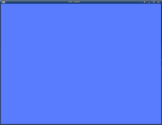
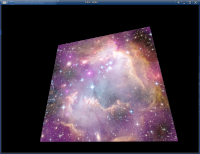

<h1 align="center">
    vke.net
    <br>  
    Vulkan Engine for .NET
    <br>  
<p align="center">
  <a href="https://www.nuget.org/packages/vke"></a>
  <a href="https://travis-ci.org/jpbruyere/vke.net">
      
  </a>
  <a href="https://ci.appveyor.com/project/jpbruyere/vke-net">
	
  </a>
  <a href="https://www.paypal.me/GrandTetraSoftware">
    
  </a>
</p>
</h1>

<p align="center">
  <a href="https://github.com/jpbruyere/vke.net/blob/master/samples/pbr/screenshot.png">
    <kbd></kbd>
  </a>
   <br>adaptation of the gltf PBR sample from Sacha Willems</br>
</p>

### Presentation
**vke.net** (_vulkan engine for .net_) a vulkan abstraction layer writen in **c#** composed of high level classes encapsulating [vulkan](https://www.khronos.org/vulkan/) objects and commands with `IDispose` model and **reference counting**. [GLFW](https://www.glfw.org/)  handles the windowing system.

Vke use autogenerated [vk.net](https://github.com/jpbruyere/vk.net) library for low level binding to vulkan.

Use the 'download_datas.sh' script for downloading sample's datas.

vke is in early development stage.

### Requirements
- [GLFW](https://www.glfw.org/) if you use the `VkWindow` class.
- If you want to use `jpg`, `jpeg`, `png` image [libstb](https://github.com/nothings/stb) (on debian install **libstb-dev**). Note that `ktx` image loading has no dependencies.
- [Vulkan Sdk](https://www.lunarg.com/vulkan-sdk/), **glslc** has to be in the path.
- optionaly for ui, you will need [vkvg](https://github.com/jpbruyere/vkvg).

### Quick Start

Create a new dotnet console project, and add the [vke nuget package](https://www.nuget.org/packages/vke) to it.

```xml
<Project Sdk="Microsoft.NET.Sdk">
	<TargetFrameworks>net472</TargetFrameworks>
	<OutputType>Exe</OutputType>

	<ItemGroup>
	  <PackageReference Include="vke" />
	</ItemGroup>
</Project>
```
For automatic shader compilation to SpirV, add also the [SpirVTasks](SpirVTasks/README.md) nuget package.

```xml
	<ItemGroup>    
	<PackageReference Include="SpirVTasks" />
		<GLSLShader Include="shaders\*.*" />		
	</ItemGroup>
```
### Samples

|                    Title                     |                    Screen shots                    |
| :------------------------------------------: | :------------------------------------------------: |
| [ClearScreen](samples/ClearScreen/README.md) |  |
|    [Triangle](samples/Triangle/README.md)    |     |
|    [Textured](samples/Textured/README.md)    |     |


### Features

- physicaly based rendering, direct and deferred
- glTF 2.0
- ktx image loading.
- Memory pools


